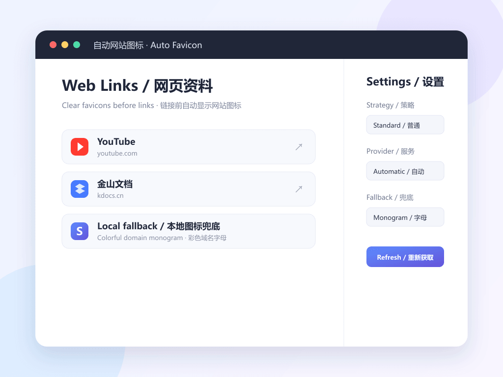

[English](README.md) | 简体中文

# 自动网站图标

最开始我一直在使用 [chenshinshi/link-icon](https://github.com/chenshinshi/link-icon)，它提供的网站图标和块引用图标很好用。随着笔记中的网站越来越多，静态图标库难以覆盖所有域名，于是我参考它“在链接前显示图标”的思路，通过 **Vibe Coding** 做了这个自动获取网站图标的插件。

这个项目不是为了替代 `link-icon`，更适合与它配合使用：`link-icon` 负责精选图标、自定义图标和块引用，本插件负责自动补充未收录网站。现在将它分享出来，希望能为经常在笔记中整理网页链接的朋友提供一点帮助。

插件仍在持续完善中。如果遇到图标获取失败、样式冲突或其他问题，欢迎反馈具体链接、思源版本和使用场景。

## 插件功能

- 自动识别文档中的 HTTP/HTTPS 超链接，并在链接前显示网站图标。
- 解析网页声明的 `rel=icon`、Apple Touch Icon、Web App Manifest 和 `/favicon.ico`。
- 支持 FaviconKit、favicon.im、Icon Horse、自定义服务以及多来源自动组合。
- 支持普通网络、代理网络和仅访问链接网站三种获取策略。
- 图标下载后保存在思源本地，后续优先使用缓存。
- 冷门网站无法取得真实图标时，可在本地生成彩色域名字母图标。
- 可调整图标尺寸、缓存有效期和重新获取全部图标。

## 获取策略怎么选

| 策略 | 会访问什么 | 适合场景 |
|---|---|---|
| 普通网络（推荐） | 链接网站自身和所选第三方服务；不请求 Google、DuckDuckGo | 中国大陆网络和日常使用 |
| 代理网络 / 尽量获取 | 在普通网络来源之外，追加 Google、DuckDuckGo | 已开启可供思源使用的代理，希望尽量取得真实图标 |
| 只访问链接网站 | 只读取目标网页、Manifest 和 `/favicon.ico` | 不希望把域名发送给第三方服务 |

三种策略都会优先读取网站自身。国外网站即使无法直连，只要第三方服务已经收录其图标，普通网络模式仍可能显示真实图标；否则使用本地彩色字母。只有“只访问链接网站”严格依赖当前网络能否访问目标网站。

## 第三方图标服务

- **自动组合（推荐）**：依次尝试 FaviconKit 和 favicon.im。
- **FaviconKit**：当前网络实测对常见国内外网站覆盖较好。
- **favicon.im**：支持多来源解析，但部分网络环境可能出现连接超时。
- **Icon Horse**：常见网站返回真实图标，未知网站可能返回字母占位图。
- **自定义服务**：用 `{domain}` 作为域名占位符，例如 `https://example.com/favicon/{domain}`。

## 与 link-icon 配合使用

本插件和 `link-icon` 的定位不同：

- `link-icon` 提供人工整理的静态网站图标、用户自定义图标以及思源块引用图标。
- 本插件负责自动发现、下载和缓存未收录网站的 favicon。

推荐同时使用，并关闭本插件的“覆盖 link-icon 网站图标”选项。这样：

1. `link-icon` 已收录或手动设置的精美图标优先显示；
2. 本插件为 `link-icon` 没有覆盖的域名自动补充图标；
3. 思源文档和块引用图标继续由 `link-icon` 处理。

如果更喜欢网站当前发布的真实 favicon，可以开启“覆盖 link-icon 网站图标”。本插件暂不重复维护一套静态品牌图标库，也暂不重复实现块引用图标功能。

## 使用说明

插件只能装饰思源已经识别为链接的元素。纯文本 URL 需要先转换成超链接，例如粘贴浏览器地址、输入后按空格或回车、使用 Markdown 链接语法，或者选中文字后添加链接。

首次遇到一个域名时可能需要等待片刻。修改获取策略或第三方服务后，可以在设置中点击“重新获取全部图标”。

## 隐私说明

首次遇到域名时，插件会通过思源内核访问公开网页以解析图标。普通网络模式可能把域名发送给所选第三方图标服务；代理网络模式还可能发送给 Google 和 DuckDuckGo。插件不会向这些服务发送笔记内容、链接标题或完整路径。

内网地址、本机地址不会被自动解析或发送给外部服务。若希望尽量减少第三方请求，请选择“只访问链接网站”。

## 参考与致谢

- 本插件的需求来源、链接前置图标的展示方式以及与思源编辑器链接结构的适配思路，参考了 [chenshinshi/link-icon](https://github.com/chenshinshi/link-icon)。感谢原作者及相关贡献者提供的优秀插件。
- 当前版本没有打包 `link-icon` 的静态图标库，也没有直接复制其块引用功能；自动解析、多来源获取、缓存验证、网络策略和设置界面为本项目的独立实现。
- 如果你更喜欢 `link-icon` 精选或手动配置的图标，建议关闭“覆盖 link-icon 网站图标”，让两个插件各自发挥优势。

## 开源协议

本项目采用 [MIT License](LICENSE) 开源，可以自由使用、修改和分发，但请保留版权和许可声明。

## 更新记录

### 0.5.0

- 将获取策略改为“普通网络”“代理网络 / 尽量获取”“只访问链接网站”。
- 普通网络不再请求 Google 和 DuckDuckGo。
- 增加自动组合、FaviconKit、favicon.im、Icon Horse 和自定义服务。
- 自动组合优先尝试 FaviconKit，再尝试 favicon.im。
- 将图标覆盖设置改为“覆盖 link-icon 网站图标”，新安装默认关闭，便于两个插件配合使用。
- 增加英文 README 和中英文设置界面，跟随思源语言自动切换。

### 0.4.0

- 增加本地彩色字母兜底，冷门网站也能获得稳定的视觉标识。
- 增加图标尺寸、缓存天数、来源优先级和缓存管理设置。
- 增加缓存数量显示、清除缓存和重新获取全部图标。
- 获取失败后进入短暂冷却，避免编辑时重复请求。

### 0.3.0

- 使用思源网络代理解析网页声明、Manifest、根目录和多个 favicon 服务。
- 启动时验证缓存，自动淘汰旧版本或损坏的图标文件。
- 只有图片下载、写入、重新读取和解码全部成功后才显示，避免空白占位覆盖其他插件。

### 0.2.0

- 不再给编辑器中的链接写入内联 CSS 变量。
- 改为在页面头部生成插件级样式表，解决编辑后出现 `{: style="..."}` 的问题。

### 0.1.0

- 完成初始版本。
- 识别外部链接域名，通过 favicon.im 获取图标并保存到思源本地。
