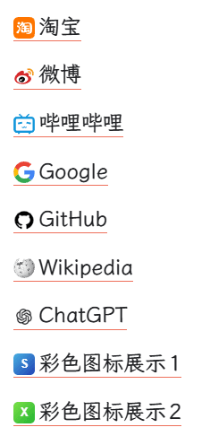

[English](README.md) | [简体中文](README.zh-CN.md)

# Auto Favicon 自动网站图标

Auto Favicon 自动为思源中的 HTTP/HTTPS 网页链接获取、显示并在本地缓存网站图标。无法获得真实 favicon 时，可以在本地生成彩色域名字母图标。

## 主要功能

- 从目标网页、`/favicon.ico`、Web App Manifest 和可选图标服务发现网站图标。
- 提供普通网络、代理网络和只访问链接网站三种策略。
- 将验证通过的图标缓存在思源工作空间，后续直接读取本地文件。
- 支持全局及按域名设置字母、颜色和形状。
- 支持为域名上传自定义图片、填写图片 URL，或从发现的候选图标中选择，并可选择让其子域名共用。
- 可与 **「链接图标」** 配合，并保留它的精选和自定义图标。
- 通过顶部工具栏快速切换显示策略、刷新当前文档、管理缓存或打开设置。

## 缓存策略

打开文档时插件会扫描其中的网页链接，但有效缓存会直接从本地读取，不会再次访问外部网络。只有首次出现、已经过期、文件丢失或损坏、解析版本变化，或者用户主动刷新时才会重新获取。

- 默认有效期为 30 天。
- 填写 `0` 表示一直保留，直到手动清理。
- 本地生成的彩色字母也遵循相同有效期。
- 获取失败后，本次插件运行期间暂停重试 10 分钟。
- 主动刷新失败时继续使用原有图标，不会先删除可用缓存。
- 手动选择的图标会固定保存在本地，普通缓存清理和过期不会删除；恢复自动获取后才解除。
- 图标文件位置：`工作空间/data/public/auto-favicon/`。
- 缓存索引：`favicon-cache.json`，由思源插件数据接口管理；用于刷新的地址只保留协议、域名和端口。

缓存管理支持重新获取当前文档、重新获取全部自动缓存域名、搜索缓存，以及单独刷新或删除某个域名。

## 与「链接图标」配合

[「链接图标」](https://github.com/chenshinshi/link-icon)是插件市场中的名称，其项目名为 `link-icon`。推荐使用“智能补充”，优先级为：

1. 「链接图标」的精选或用户自定义图标。
2. Auto Favicon 获取到的真实 favicon。
3. Auto Favicon 在本地生成的彩色字母。
4. 「链接图标」的通用网页占位符。

本项目不会分发「链接图标」的静态图标库，也没有复制它的块引用实现。思源文档和块引用图标仍由「链接图标」处理。

固定的自定义图标同样遵循显示策略：“智能补充”仍会让「链接图标」的有效图标优先；“本插件图标优先”则优先显示固定图标。

## 网络与隐私

- **普通网络：** 目标网站加所选图标服务，不请求 Google 或 DuckDuckGo。
- **代理网络：** 额外尝试 Google 和 DuckDuckGo，尽量提高成功率。
- **只访问链接网站：** 仅访问链接网站，失败后使用本地兜底图标。

插件不会把 localhost、`.local`、回环、链路本地和私有 IP 地址发送给图标服务。第三方服务只会收到网站域名，不会收到笔记内容、锚文本或完整页面路径。

## 安装与使用

市场上架后可直接从思源集市安装；也可以把 `package.zip` 解压到 `工作空间/data/plugins/auto-favicon/`。启用插件，在设置中选择网络和显示策略，然后使用顶部工具栏的 Auto Favicon 按钮执行常用操作。

## 致谢与许可

本插件对链接前置图标的需求和展示思路受到[「链接图标」](https://github.com/chenshinshi/link-icon)启发，通过 **Vibe Coding** 完成，采用 [MIT License](LICENSE) 开源。

### 0.5.1

- 增加与「链接图标」配合的“智能补充”。
- 增加可自定义的本地字母图标和按域名设置。
- 增加顶部工具栏快捷菜单和详细缓存管理。
- 增加按域名上传图片、使用图片 URL 和候选图标选择。
- 明确缓存策略、保存位置和面向用户的描述。

完整版本历史请查看 [GitHub Releases](https://github.com/Acetab/auto-favicon/releases)。
